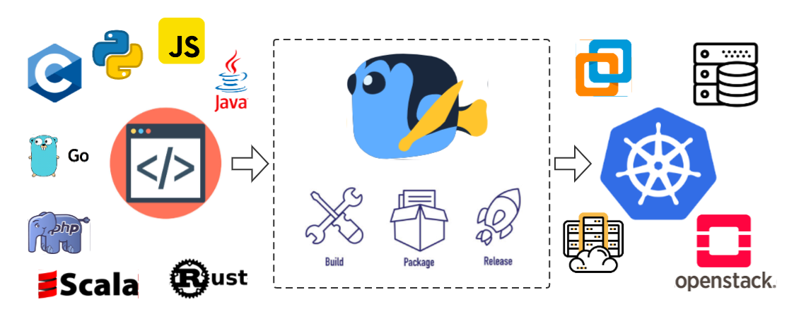
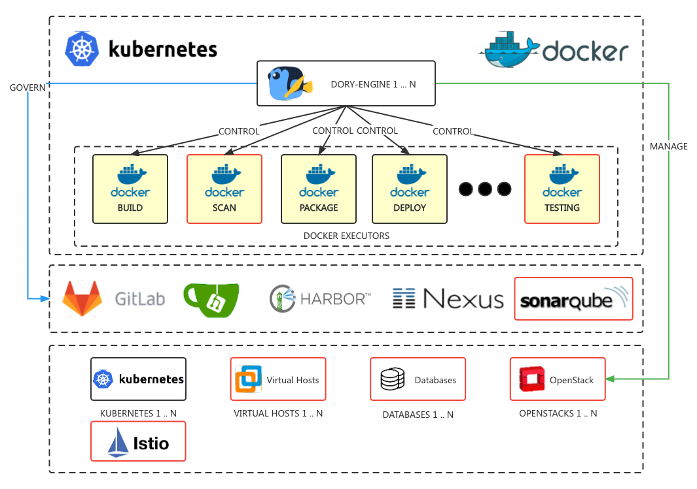
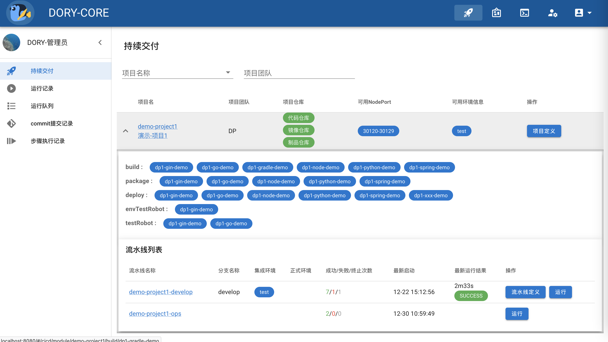
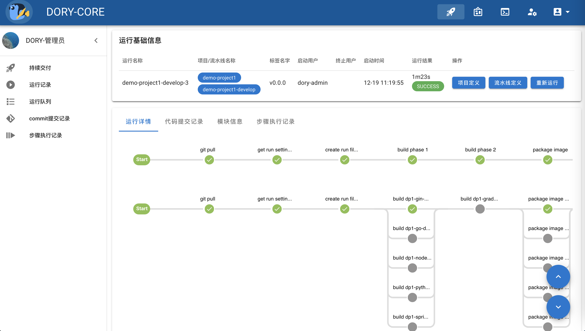
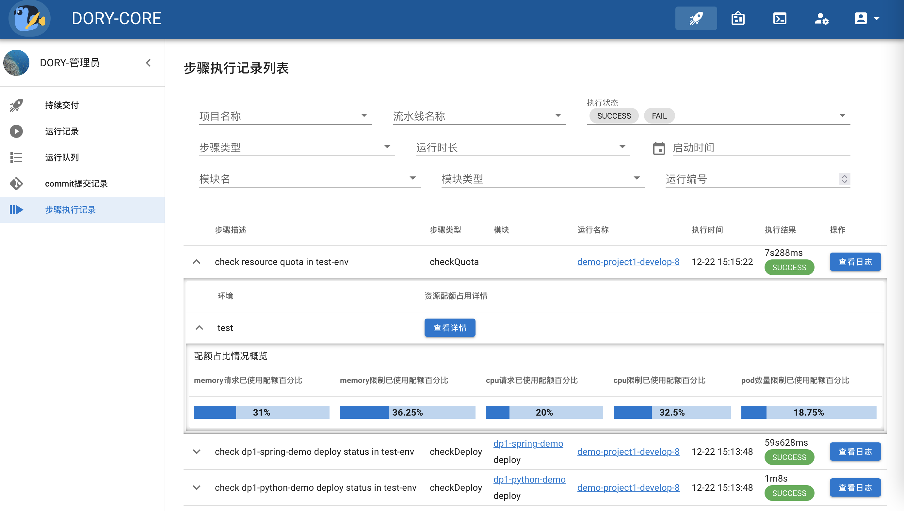
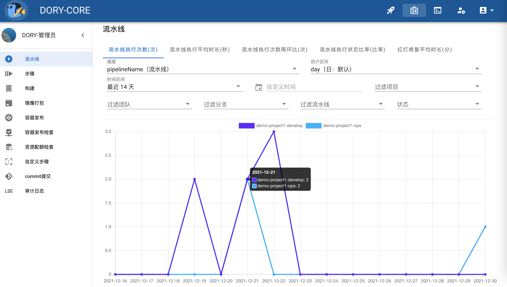

# Dory-Engine是一个简单得非常吓人的应用上云引擎，dory-dashboard是Dory-Engine的WebUI管理界面

- [English documents](README.md)
- [中文文档](README-zh.md)

- [Github](https://github.com/dory-engine/dory-dashboard)
- [Gitee](https://gitee.com/dory-engine/dory-dashboard)


详细参见官方网站: [https://doryengine.com](https://doryengine.com)

## 什么是`Dory-Engine`



- `Dory-Engine` 是一个极简的应用上云引擎

- 应用开发者无需掌握复杂的DevOps和云原生知识，即可实现应用从源代码交付到云原生环境。

### `Dory-Engine`架构



- 分布式: Dory-Engine使用无状态设计架构，可部署在Kubernetes或者docker中，轻松实现分布式水平扩缩容。
- 全容器: 步骤都在远程步骤执行器(Docker)中执行，可以轻松实现负载分担。
- 高弹性: 远程步骤执行器(Docker)可以根据工作负载，进行水平扩缩容实现高弹性。
- 易扩展: 通过容器技术，让步骤支持各种执行环境，实现应用上云流程的灵活扩展。
- 多云编排: 可以同时接管多个不同的云原生环境、主机环境(企业版原生支持)、各种数据库环境(企业版原生支持)，把应用发布到多个不同环境。
- 协同治理: 接管DevOps持续交付工具链各个组件，自动开通配置好各个组件和云原生环境，应用上云从未如此简单。

## 编译 dory-dashboard

- dory-dashboard 需要node v1.14.x以上版本编译。

```shell script
# 克隆源代码
git clone https://github.com/dory-engine/dory-dashboard.git

# 从源代码编译dory-dashboard
cd dory-dashboard
npm install && npm run build

# 打包输出目录
ls -alh dist
```

## 截图

- 一个项目支持多个微服务的上云



- 应用的微服务上云流程概览



- 步骤执行记录抽取关键日志信息，无需返查冗长的日志



- 多维度的度量指标，呈现研发效能趋势



