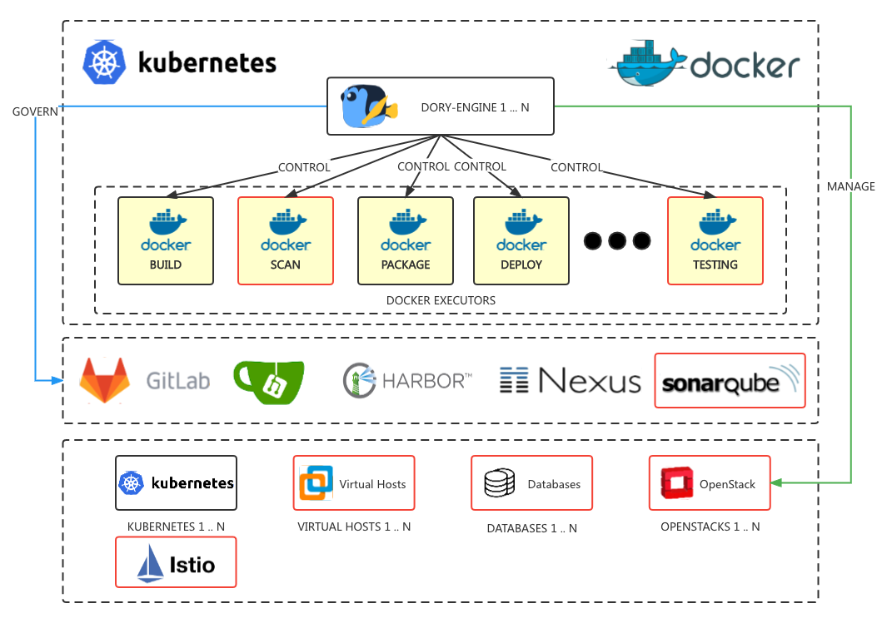

# `dory-dashboard` is WebUI for `Dory-Engine`

- [English documents](README.md)
- [中文文档](README-zh.md)


For more detail please visit our official website: [https://doryengine.com](https://doryengine.com)

## What is `Dory-Engine`


- `Dory-Engine` is an engine to make your application to Cloud-Native infrastructure extremely easy. 

- Developers can publish applications from source code to kubernetes cluster without writing complicated kubernetes yaml deployment files.

### `Dory-Engine` Architecture



- Distributed: Dory-Engine uses a stateless design architecture and can be deployed in Kubernetes or docker to easily achieve distributed horizontal expansion and contraction.
- Containerization: Steps are executed in a remote step executor (Docker), which can easily achieve load sharing.
- High flexibility: The remote step executor (Docker) can perform horizontal expansion and contraction according to the workload to achieve high flexibility.
- Easy to expand: Through container technology, the steps can support various execution environments and realize the flexible expansion of the application cloud process.
- Multi-cloud orchestration: It can take over multiple different cloud native environments, host environments (native support for Enterprise Edition), various database environments (native support for Enterprise Edition), and publish applications to multiple different environments at the same time.
- Collaborative governance: Taking over the various components of the DevOps continuous delivery tool chain, automatically opening and configuring each component and cloud native environment, application to the cloud has never been easier.

## Build dory-dashboard

- dory-dashboard require node version v1.14.x+

```shell script
# clone dory-dashboard source
git clone https://github.com/dory-engine/dory-dashboard.git

# build dory-dashboard from source
cd dory-dashboard
npm install && npm run build

# compile output directory
ls -alh dist
```
